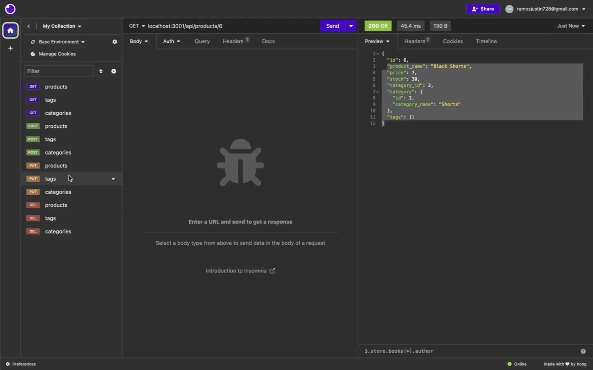
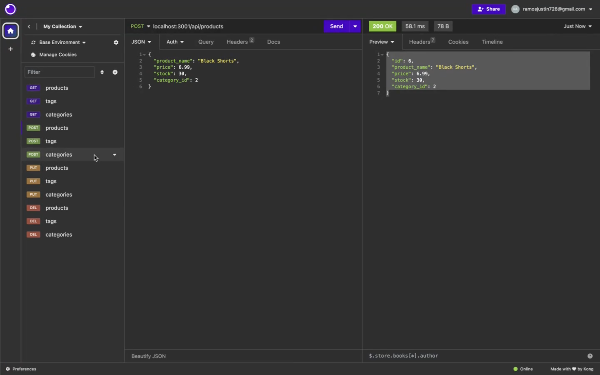
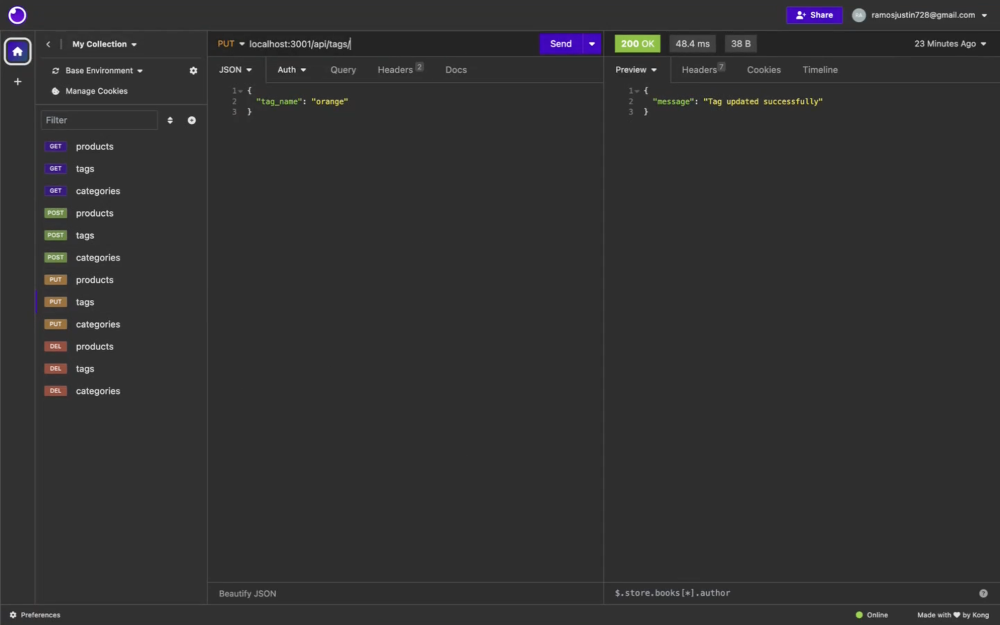
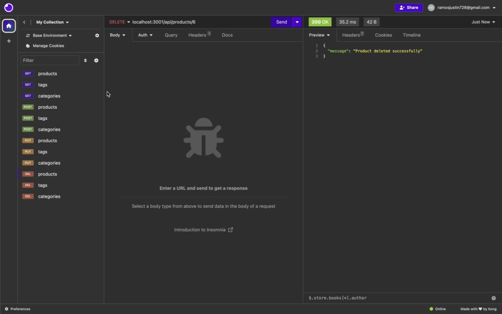

# eshopmastery

## Description
EshopMastery is a back end program that uses a mysql Databse that let you do GET, POST, PUT, and DELETE requests.

Walkthrough: https://drive.google.com/file/d/1fJUkSQLBtzu6TgVUibzvpppgJ02rhP9z/view
## Usage
npm install
need .env file with the DB_NAME, DB_USER, DB_PW
go to MYSQl shell put command "SOURCE db/schema.sql;"
then type "quit"
type in terminal "npm run seed" to seed database
type "npm start" to start server
## Images

## Credits
Justin
## License
MIT
